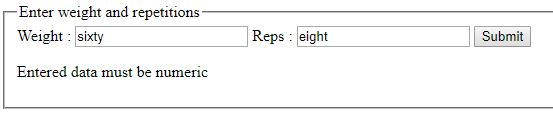

# 1DV610 Laboration 2 & 3
Repo for laboration 2 and 3 in the course 1dv610 at Linnaeus University, Kalmar, Sweden.

## Extra feature: 1RM Maximum calculator

https://en.wikipedia.org/wiki/One-repetition_maximum

## UC5 Calculate 1RM Maximum (logged out)
### Main scenario
 1. Starts when a user wants to use the 1RM calculator
 2. System asks for weight and repetitions performed
 3. User provides weight and repetitions performed, and presses "submit"
 4. System handles inputted data and shows a table presenting data to the user
 
 ### Alternate Scenarios
 4a. Input data is not numeric
   1. System presents an error message
   2. Step 2 in main scenario

## UC6 Calculate 1RM Maximum (logged in)
### Preconditions
A user is authenticated. Ex. UC1, UC3
### Main scenario
 1. Starts when a user wants to access its 1RM data
 2. The system presents the 1RM table, containing data calculated from input during last login
 
 ## Test case 5.1, Calculate 1RM Max successfully
 Calculate a 1RM max.

### Input:
* Testcase 1.1
* Input numeric values in the "weight"- and "reps"-fields. For example: "60" & "8".
 
### Output:
 * A table containing the data is shown.
 

***

## Test case 5.2: Failed calculation without entering any fields
Make sure calculation cannot happen without entering any fields

### Input:
 * Testcase 1.1
 * Make sure both "weight" and "reps" is empty
 * Press "submit" button
 
### Output:
 * The text "Entered data must be numeric", is shown.
 * A form for calculating 1RM Max is shown.

***

## Test case 5.3: Failed calculation by entering non-numberic data
Make sure calculation cannot happen by entering non-numberic data

### Input:
 * Testcase 1.1
 * Make sure both "weight" and "reps" has a non-numeric value. For example: "sixty" & "eight".
 * Press "submit" button
 
### Output:
 * The text "Entered data must be numeric", is shown.
 * A form for calculating 1RM Max is shown.

***
## Test case 6.1: Failed calculation by entering non-numberic data
Make sure calculation cannot happen by entering non-numberic data

### Input:
 * Testcase 1.7
 * Testcase 5.1
 
### Output:
 * A form for calculating 1RM Max is shown, retaining data the user entered during last login.
 * A table containing the data is shown.
 

***
